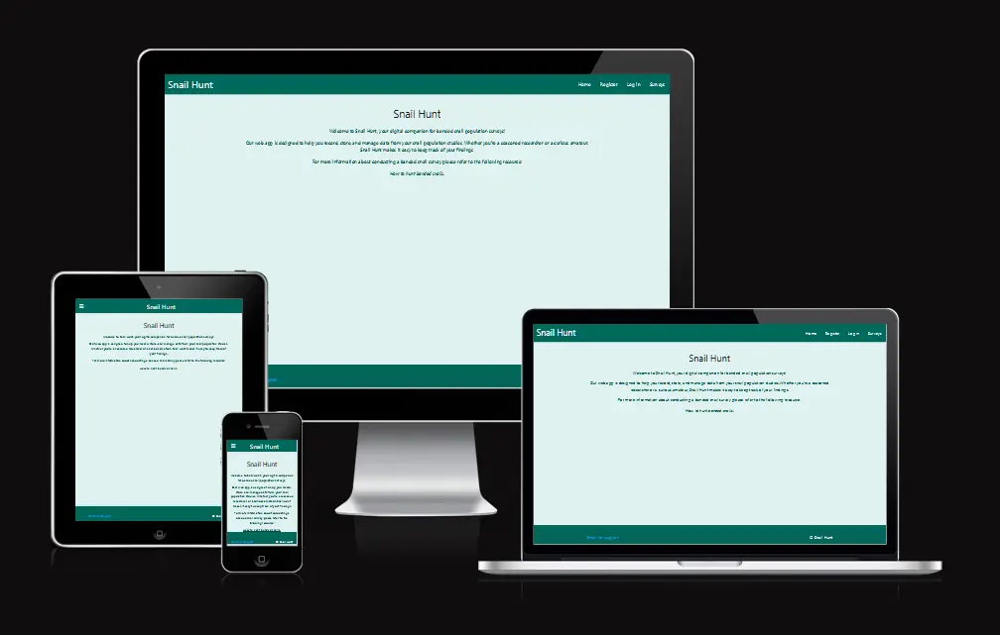
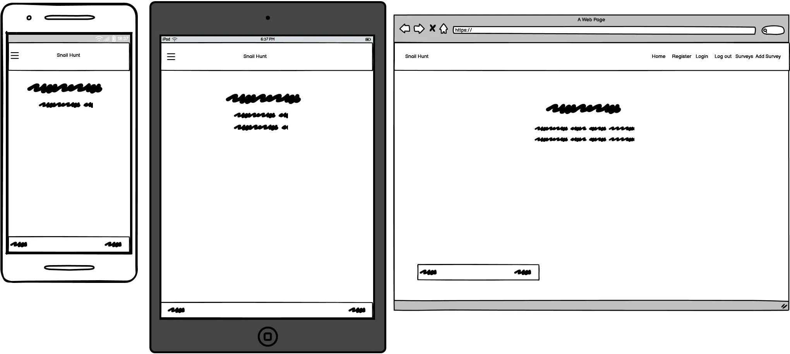
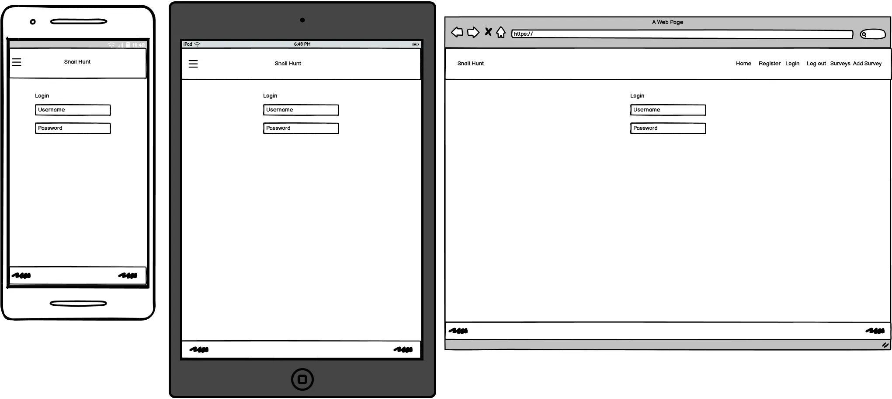
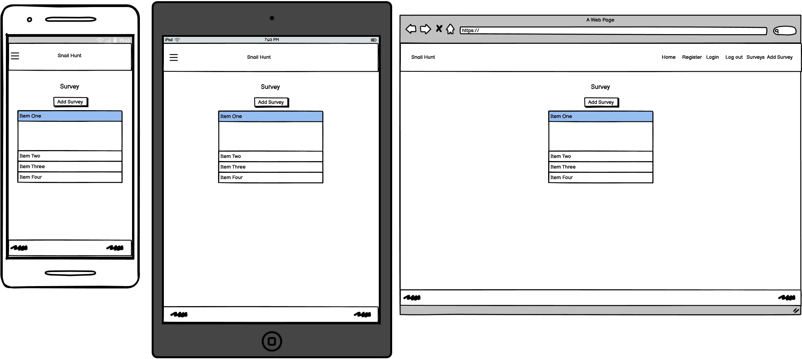
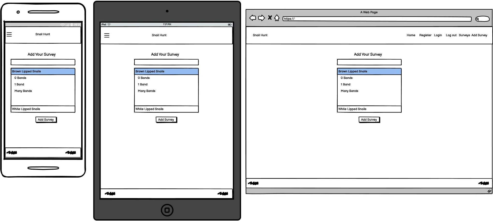
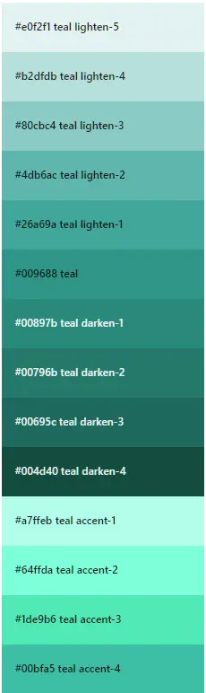

# Milestone 3: The Snail Hunt
## Rationale and Development Plan for the Snail Hunt Web Application
### Rationale
The Evolution MegaLab study is a science project that aims to gather data on banded snails across Europe to study their adaptation and evolution over time. This data is crucial for understanding how climate change and changes in other animals and plants around them are affecting these snails.

The Snail Hunt web application serves as a platform for the public to contribute to this study by recording their observations of snail habitats, shell color, and banding pattern. By making it easy for anyone to contribute data, the application significantly expands the scope and scale of the study. It also provides an educational opportunity for children and adults alike to learn about evolution and contribute to real scientific research.

### Development Plan
The web application will be developed using the following steps:

Requirements Gathering: Understand the needs of the users and the data that needs to be collected for the study. This includes details about the snails and their habitats, as well as user information for tracking and acknowledging contributions.

Database Design: Design a database schema that accurately represents the data to be collected. This will involve defining tables for users and surveys, and establishing relationships between them.

User Interface Design: Design a user-friendly interface for users to register, log in, and submit their survey data. The design should be intuitive and accessible to users of all ages and levels of technical proficiency.

Backend Development: Implement the server-side logic to handle user registration, login, and data submission. This includes validating and storing the data in the database, and managing user sessions.

Frontend Development: Implement the client-side logic to interact with the backend, display data to the user, and provide a smooth user experience.

Testing: Conduct thorough testing to ensure the application works as expected and handles edge cases gracefully.

Deployment: Deploy the application to a production environment and set up any necessary infrastructure, such as a database server and web server.

By following this plan, I can develop a web application that meets the needs of the Evolution MegaLab study and its contributors.

## User Experience (UX) / Needs / Stories
### First Time Visitor Goals
As a first time user:

- Understand what the site is for.
- Find out more information about the site's purpose.
- Register for an account.

## Returning Visitor Goals
As a returning registered user:

- Log in to my account.
- Log out of my account.
- Create, view, update, and delete my entries.
- Search all entries.
- Export data to csv.
- See and edit my profile.
- Contact someone for support.
- Reset password.
- User authorisation / access control.

## Strategic Tradeoffs

I have assigned a score out of five (5) to the importance and viability / feasibility for each of the user goals to establish the immediate focus. Anything fallout outside of the immediate focus will be considered for a future implementation.

|Opportunity / Problem|Importance|Viability / Feasibility|Result|Possible Solution|
|-|-|-|-|-|
|Understand what the site is for|5|5|Will be addressed.|Include an introduction on the main page.|
|Find out more information about the site's purpose|5|5|Will be addressed.|Link to an external resource that describes the study.|
|Create, view, update, and delete my entries|5|5|Will be addressed.|Use the Flask Framework and Postgresql to store and manipulate information.|
|Register for an account|5|5|Will be addressed.|Include a registration page.|
|Log in to my account|5|5|Will be addressed.|Include a login page.|
|Log out of my account|5|5|Will be addressed.|Include a logout link.|
|Search all entries|5|1|Future implementation.|Currently out of scope.|
|Export data to a spread sheet|5|1|Future implementation.|Currently out of scope.|
|See and edit my profile|5|1|Future implementation.|Currently out of scope.|
|Contact someone for support|5|5|Will be addressed.|Add an email address in the footer.|
|Reset password|5|1|Future implementation.|Add the ability to reset a password via email.|
|User authorisation / access control|5|5|Will be addressed.|Add user authentication.|

## Features
The web application will include the following features:

1. **Home Page**: An introductory page with a link to an external resource for more information. This addresses the need to understand the site's purpose and find more information.
2. **Survey Viewing Page (surveys.html)**: A page where users can view surveys, addressing the need to view surveys.
3. **Survey Addition Page (add_surveys.html)**: A page where users can add new surveys, addressing the need to add surveys.
4. **Survey Edit/Delete Functionality**: A feature allowing users to update and delete surveys, addressing the need to modify or remove surveys.
5. **Account Registration Page (register.html)**: A page where users can register for an account, addressing the need for users to create their own accounts.
6. **Login Page (login.html)**: A page where users can log in to their accounts, addressing the need for users to access their accounts.
7. **Logout Functionality**: A feature allowing users to log out of their accounts, addressing the need for users to securely end their sessions.
8. **Confirmation Alerts**: Alerts that confirm when a user has submitted an edit to a survey, confirmed an edit, deleted a survey, added a survey, or logged out.
9. **Materialize Toasts**: Notifications that appear after a user has edited, added, or deleted a survey.

## Database
### Data Operations
#### Creating a User
A new user can be created by sending a POST request to the /register route with the following parameters:
- username: The username of the new user.
- password: The password of the new user.
- The password is hashed before being stored in the database.

#### Logging In
A user can log in by sending a POST request to the /login route with the following parameters:
- username: The username of the user.
- password: The password of the user.
- The password is verified against the stored hash.

#### Logging Out
A user can log out by navigating to the /logout route.

#### Creating a Survey
A new survey can be created by sending a POST request to the /add_survey route with the following parameters:
- survey_date: The date of the survey.
- survey_time: The time of the survey.
- survey_location: The location of the survey.
- survey_habitat: The habitat of the survey.
- survey_recorder: The recorder of the survey.
- Various counts of different types of snails.

#### Updating a Survey
A survey can be updated by sending a POST request to the /edit_survey route with the same parameters as creating a survey.

#### Deleting a Survey
A survey can be deleted by navigating to the /delete_survey route.

#### Viewing Surveys
All surveys can be viewed by navigating to the /surveys route. The surveys are ordered by the survey date.

#### Error Handling
The application has error handlers for the following HTTP status codes: 403, 404, 405, and 500. When these errors occur, the user is redirected to a corresponding error page.

All POST requests require the user to be logged in. If a user is not logged in, they will be redirected to the login page.

### ERD Components
1. Entity: User
   - Attributes:
     - id (Primary Key)
     - username (text)
     - password (hashed text)
     - surveys (relationship to Survey)

2. Entity: Survey
   - Attributes:
      - survey_id (Primary Key)
      - survey_date (date)
      - survey_time (time)
      - survey_location (text)
      - survey_habitat (text)
      - survey-recorder (text)
      - user_id (integer, foreign key referencing User id)
      - yellow_brown_lipped_snail_0_bands (integer)
      - pink_brown_lipped_snail_0_bands (integer)
      - brown_brown_lipped_snail_0_bands (integer)
      - yellow_brown_lipped_snail_1_band (integer)
      - pink_brown_lipped_snail_1_band (integer)
      - brown_brown_lipped_snail_1_band (integer)
      - yellow_brown_lipped_snail_many_bands (integer)
      - pink_brown_lipped_snail_many_bands (integer)
      - brown_brown_lipped_snail_many_bands (integer)
      - yellow_white_lipped_snail_0_bands (integer)
      - pink_white_lipped_snail_0_bands (integer)
      - brown_white_lipped_snail_0_bands (integer)
      - yellow_white_lipped_snail_1_band (integer)
      - pink_white_lipped_snail_1_band (integer)
      - brown_white_lipped_snail_1_band (integer)
      - yellow_white_lipped_snail_many_bands (integer)
      - pink_white_lipped_snail_many_bands (integer)
      - brown_white_lipped_snail_many_bands (integer)

# Future Implementations
The following features are planned for future development:
1. **Search Functionality**: A feature that allows users to search all entries, addressing the need to easily find specific entries.
2. **Data Export**: A feature that allows users to export data to a spreadsheet, addressing the need to work with the data outside of the application.
3. **Password Reset**: A feature that allows users to reset their password via email, addressing the need for account security and recovery.
4. **Profile Page**: A page where users can edit and update their profile details, addressing the need for users to manage their account information.

## Success Metrics
The following metrics can be measured to track the website's success:
- Google Analytics: This tool can provide a wealth of data about your website's users, including how they find your website, which pages they visit, how long they stay, and much more. This can help you understand what's working well and what might need improvement.
- Search Engine Listings: The position of your website in search engine results can be a good indicator of its visibility and reach. Tools like Google Search Console can provide insights into your website's search engine performance.
- Meta Descriptions and Titles: These are important for SEO and can influence click-through rates from search engine results. They should be descriptive and enticing, effectively summarizing the content of each page.
- User Feedback: Direct feedback from users can be invaluable in assessing the website's success. This could be collected through surveys, contact form submissions, or social media interactions.
- Conversion Rates: If your website has specific goals (like form submissions, sign-ups, or purchases), tracking the conversion rates for these actions can provide a clear measure of success.
- Page Load Times: Fast-loading pages provide a better user experience and are favored by search engines. Tools like Google's Lighthouse can help you measure and optimize your load times.
- Accessibility: Ensuring your website is accessible to all users, including those with disabilities, is not only a legal requirement in some instances but also improves your website's usability and reach. Tools like the WAVE Web Accessibility Evaluation Tool can help assess your website's accessibility.

## Accessibility
- Use semantic HTML: Semantic HTML elements provide important context about the content they contain, which can greatly enhance the experience for users of assistive technologies like screen readers.
- Ensure sufficient colour contrast: This is crucial for visually impaired users or those with color blindness. Tools like the WebAIM Color Contrast Checker can help verify that your color choices meet the recommended contrast ratios.
- Provide information for screen readers where appropriate (e.g. aria-labels): ARIA labels and other ARIA roles can provide additional context and improve navigation for screen reader users.
- Descriptive Link Text: Make sure all links have descriptive text (avoid text like "click here"). Screen reader users often navigate by tabbing through links, so descriptive link text is crucial.

# Design Choices
## Sitemap
- Home
- Register
- Login
- Logout
- Add Survey
- Surveys
   - Add Survey
   - Edit Survey
   - Delete Survey

## Wireframes

## Typography / Fonts
I decided to stick with the Materialize CSS theme to keep everything coherent.
Pros:
- Consistency: Ensure a consistent look and feel.
- Compatibility: Designed to be compatible with a wide range of devices.
- Performance: System fonts, which have faster loading times.
- Maintenance: Do not need to worry about hosting font files.
Cons:
- Lack of uniqueness: Will not stand out as much.
- Limited Control: Less control of the appearance.
- Potential Inconsistencies: System fonts can vary between different operating systems.

## Icons
Icons are taken from [fontawesome's](https://fontawesome.com/) free selection.

## Styling and Colours

I have opted for a minimal and clean aesthetic, utilizing a palette of teal and green hues that are often associated with nature, the typical habitat of snails. This choice of colors aims to create a visual connection between the website's design and its content, enhancing the user's experience.

For error alerts, I have chosen to use a red palette. Red is a color universally associated with warnings and danger, making it an intuitive choice for alert messages. This ensures that these alerts are immediately noticeable and understood by users.

One potential drawback of this color scheme is that the colors may appear somewhat washed out and not as bold as they could be. This is a trade-off for the minimal and clean aesthetic. However, care has been taken to ensure that despite their softer tones, the colors still provide sufficient contrast for good readability and usability.

# Technologies
- [HTML](https://html.spec.whatwg.org/multipage/)
- [CSS](https://www.w3.org/Style/CSS/)
- [Materialize CSS](https://materializecss.com/)
- [JavaScript](https://tc39.es/)
- [Python](https://www.python.org/)
- [Jinja](https://jinja.palletsprojects.com/en/3.1.x/)
- [Flask](https://flask.palletsprojects.com/en/3.0.x/)
- [PostgreSQL](https://www.postgresql.org/)
- [SQLAlchemy](https://www.sqlalchemy.org/)

# Other Resources
- [Am I Responsive](https://ui.dev/amiresponsive/): Images of responsive design.
- [Balsamiq](https://balsamiq.com/): Wire framing.
- [Chrome Developer Tools](https://developer.chrome.com/docs/devtools/): Testing and debugging.
- [Code Institute Python Linter](https://pep8ci.herokuapp.com/)
- [ElephantSQL](https://www.elephantsql.com/)
- [ESLint](https://eslint.org/)
- [favicon.io](https://favicon.io/): For generating the favicon.
- [Font Awesome](https://fontawesome.com/): Icons.
- [Git](https://git-scm.com/): For version control and pushing to Github.
- [GitHub](https://github.com/): To store projects in a public repository.
- [GitHub Desktop](https://desktop.github.com/): Desktop software to simplify the Git/Github development workflow.
- [Heroku](https://dashboard.heroku.com/)
- [JSHint](https://jshint.com): JavaScript testing.
- [Web accessibility evaluation tool (WAVE)](https://wave.webaim.org/): For testing site accessibility quality.
- [WebP Converter](https://developers.google.com/speed/webp): Converting images to the WebP format.
- [VSCode](https://code.visualstudio.com/): Coding text editor.
- Real Python:
   - [User Management](https://realpython.com/using-flask-login-for-user-management-with-flask/)
   - [Setting up a static site](https://realpython.com/introduction-to-flask-part-1-setting-up-a-static-site/)
- Digital Ocean:
   - [How To Add Authentication to Your App with Flask-Login](https://www.digitalocean.com/community/tutorials/how-to-add-authentication-to-your-app-with-flask-login)
- [Werkzeug](https://werkzeug.palletsprojects.com/en/3.0.x/utils/)

# Testing
Please visit the [testing](./testing.md) file.

# Deployment & Local Development
VSCode and Github Desktop were used for local development and pushing code to GitHub.
## GitHub
## Steps for Forking the Github Repository
1. Log into GitHub.
2. Go to the Kartilo repository.
3. Select the 'Fork' button in the top right corner under your profile icon.
## Steps for Making a Local Clone
1. Log into GitHub.
2. Navigate to the repository you want to clone.
3. Select the '<> Code' and copy the link for your preferred method of cloning the site.
4. Use your terminal to navigate to the working directory you want use.
5. Type git clone into the terminal and paste the link you copied in step 3 and press enter.
## Database: Elephant SQL
1. Log/sign into Elephant SQL.
2. Create a new team.
3. Create new instance.
4. Select your required plan.
5. Select your region/closest data center.
6. Review your details and create the instance.
7. Return to the dashboard, click the database instance you have created, and store the database URL.
## Heroku
1. Login into Heroku.
2. Create and name a new app.
3. Enter settings, reveal and populate the config vars. with the appropriate values.
   - DATABASE_URL
   - IP
   - PORT
   - SECRET_KEY
   - DEBUG
4. Click Deploy and select a deployment method of your choosing.
5. Click 'More' and run the console.
6. Type 'python' in the console and click 'run'.
7. Enter the following into the termainl.
   - from <yourappname> import app, db
   - app.app_context().push()
   - db.create_all()
8. Exit the terminals with 'exit()'.
9. Click 'Open app' to view your app.

# Credits
## Code
- Code adapted from Real Python, Digital Ocean, and Flask Documentation. See Other Resources for links.
## Acknowledgements
- Graeme Taylor: Code Institute Mentor.
- Callum Jones: Course Facilitator at [Newcastle College University Centre](https://www.ncl-coll.ac.uk/)
- [Code Institute](https://codeinstitute.net/) for their learning resources.